# JYO Fashion Fiesta

  <!-- Replace with your project's logo -->

Welcome to **JYO Fashion Fiesta**, your ultimate destination for trendy fashion! This project is designed to provide a seamless shopping experience, showcasing a variety of stylish apparel crafted for modern fashion enthusiasts.

---

## Table of Contents
- [Project Overview](#project-overview)
- [Screenshots](#screenshots)
- [Features](#features)
- [Technologies](#technologies)
- [Getting Started](#getting-started)
- [Usage](#usage)
- [Contributing](#contributing)
- [License](#license)

---

## Project Overview
**JYO Fashion Fiesta** is built using **Create React App** and aims to offer users a visually appealing and user-friendly interface for browsing and purchasing fashionable clothing. With a focus on responsiveness and accessibility, the app is suitable for all devices.

---

## Screenshots
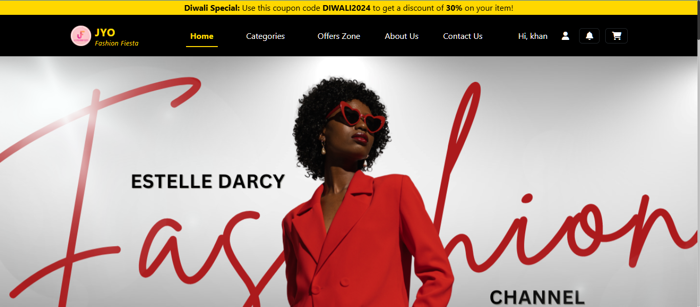
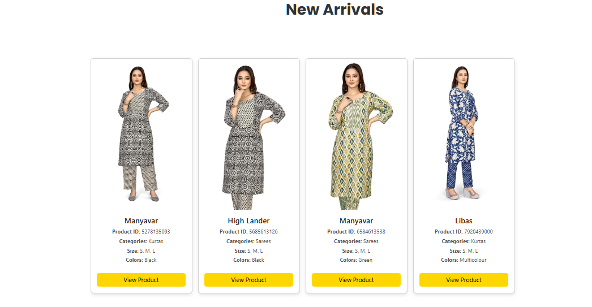
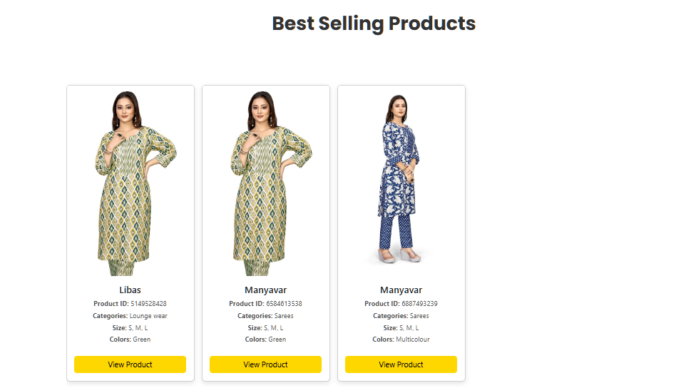
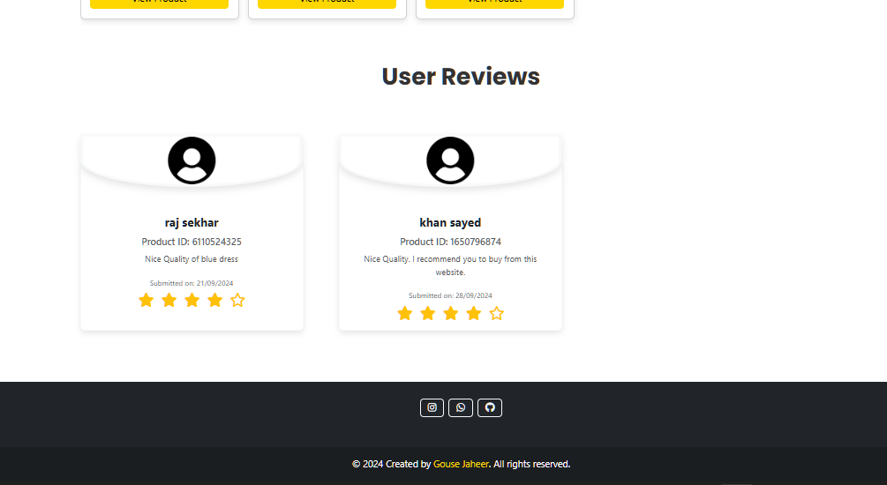
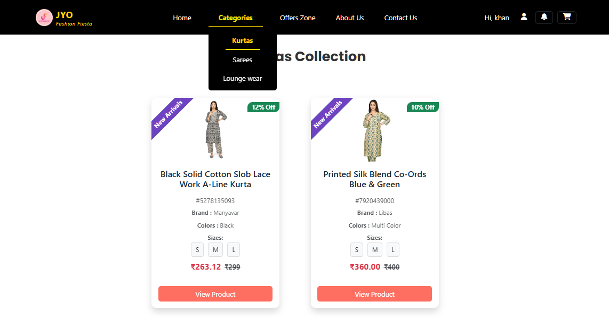
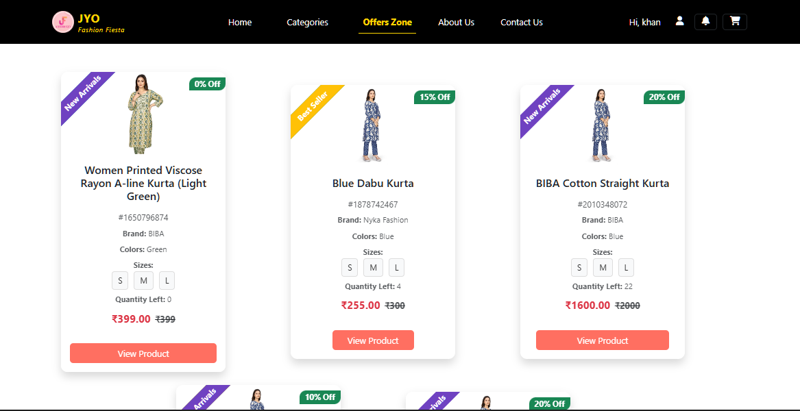
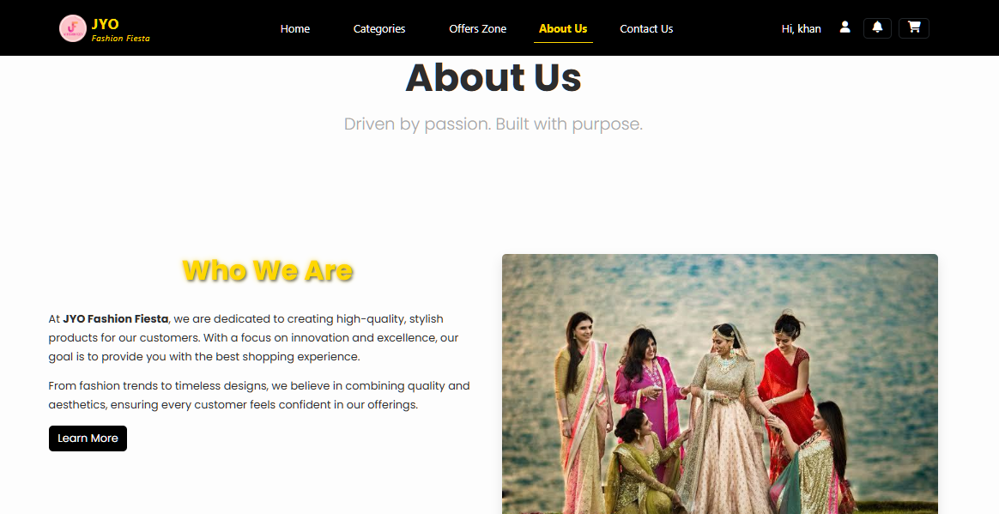
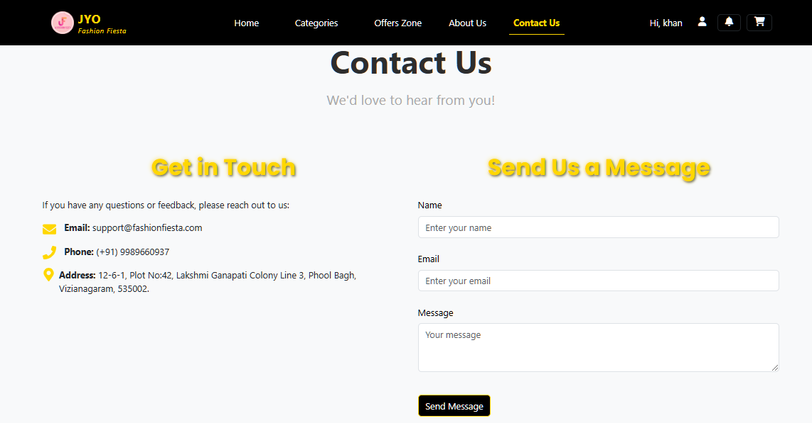
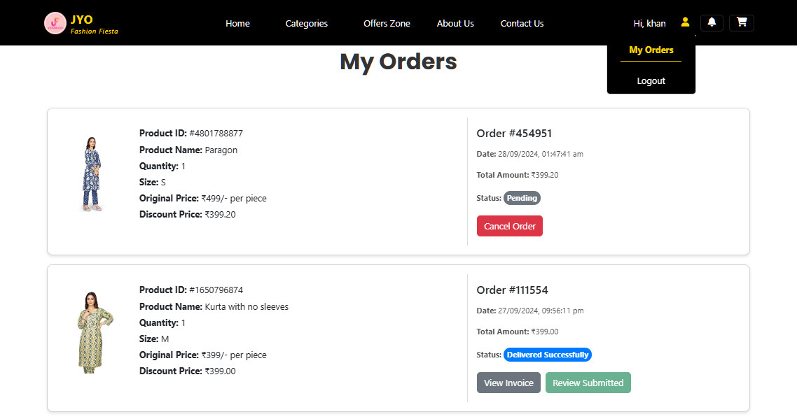
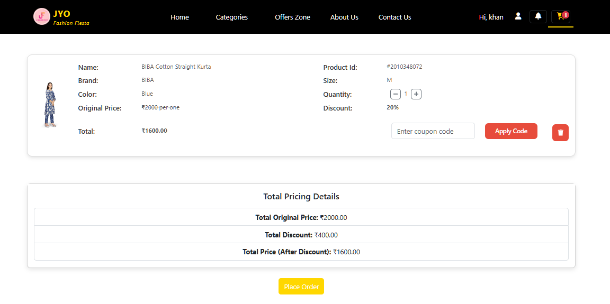
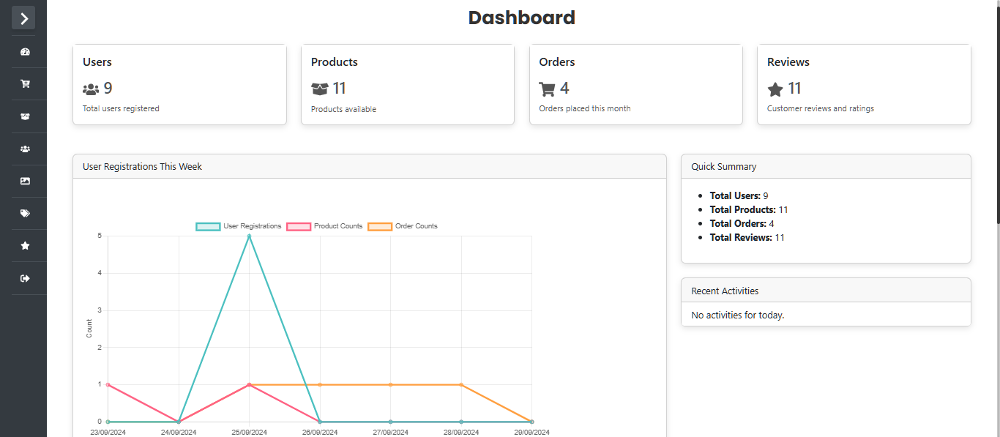


---

## Features
- **Stylish UI**: Modern design that enhances user experience.
- **Responsive Layout**: Works seamlessly on desktops, tablets, and mobiles.
- **Product Browsing**: Easily browse through various categories of clothing.
- **Shopping Cart**: Add items to the cart and manage purchases effortlessly.
- **User Authentication**: Secure login and registration process.
- **Search Functionality**: Quickly find products using the search bar.

---

## Technologies
- **React**: Frontend framework for building the user interface.
- **Firebase**: Backend services for authentication and database management.
- **Bootstrap**: CSS framework for responsive design.
- **Axios**: Library for making API requests.

---

## Getting Started

To set up this project locally, follow the steps below:

### Prerequisites
- **Node.js** (v14 or later)
- **npm** (v5 or later)

### Installation
1. Clone the repository:
   ```bash
   git clone https://github.com/yourusername/jyo-fashion-fiesta.git  <!-- Replace with your GitHub username -->
   ```
2. Navigate to the project directory:
   ```bash
   cd jyo-fashion-fiesta
   ```
3. Install the necessary dependencies:
   ```bash
   npm install
   ```

---

## Usage

To start the application, run the following command in your terminal:
```bash
npm start
```
This command launches the app in development mode. You can view it in your browser at [http://localhost:3000](http://localhost:3000). The app will automatically reload if you make edits.

### Building for Production
To build the app for production, use:
```bash
npm run build
```
This command creates a production-ready build in the `build` folder, optimizing the application for performance.

---

## Contributing

We welcome contributions to **JYO Fashion Fiesta**! If you'd like to contribute, please follow these steps:

1. **Fork the repository** to your own GitHub account.
2. **Clone the forked repository** to your local machine:
   ```bash
   git clone https://github.com/yourusername/jyo-fashion-fiesta.git  <!-- Replace with your GitHub username -->
   ```
3. **Create a new feature branch**:
   ```bash
   git checkout -b feature/YourFeature
   ```
4. **Make your changes** and **commit them**:
   ```bash
   git commit -m 'Add your feature'
   ```
5. **Push your changes** to your fork:
   ```bash
   git push origin feature/YourFeature
   ```
6. **Open a Pull Request** in the original repository.

Please ensure your code adheres to the existing style and includes appropriate tests if applicable.

---

## License

This project is licensed under the [MIT License](LICENSE). 

For more details, please refer to the LICENSE file in the repository.

---

Thank you for checking out **JYO Fashion Fiesta**! We hope you enjoy your shopping experience.

